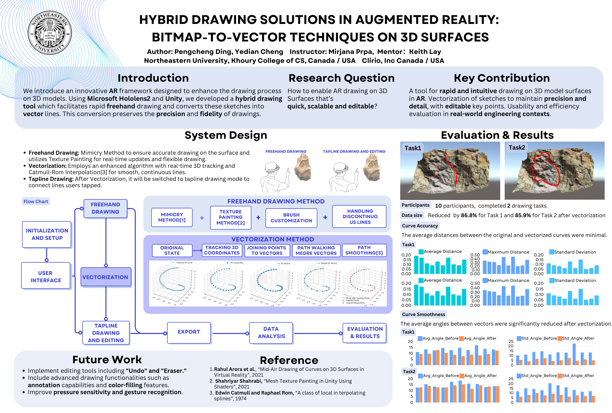

# AR Drawing

Hi everyone, here is the AR Drawing Project. This project allows you to draw on the surface of 3D objects in Augmented Reality. And here is the project poster:

# Flowchart

In the poster you can see that the flowchart of the project can be concluded like this:

1. Initialize and set up: This step will init the project and set up the environment in the Microsoft Hololens 2.
2. Freehand Drawing: This step will allow the user to draw on the surface of the 3D objects freely.
3. Vectorization: This step can vectorize the drawing and each point in the drawing is able to move.
4. Tapline Drawing: This step will allow the user to draw a line by tapping on the screen.
5. Export: This step will allow the user to export the drawing to a jpg file and its data into a csv file.
6. Data Analysis: This step will analyze the data and generate diagrams.

# File Structure

The Unity project we created is inside the *UnityProjects/ARDrawing* folder, and here is a brief description of how to find corresponding code and files from the flowchart:

1. Initialize and set up: The initialization and setup can be found in the *Assets/Scenes/Drawing* scene. Including how we set up the UI and models. And models we used are in the *Assets/Models* folder. For the input set up, you can find it in the *Assets/Scripts/InputManager.cs* file.
2. Freehand Drawing: The freehand drawing code can be found in the *Assets/Scripts/Core* folder. *Assets/Scripts/Core/InputManager.cs* Controls how to interact with the drawing. *Assets/Scripts/Core/Projection.cs* controls how to project the point onto the surface of the 3D object. And *Assets/Scripts/Rendering/TexturePaint.cs* and shader files in the same folder controls how to draw the line on the texture.
3. Vectorization: *Assets/Scripts/Core/Vectorization.cs* controls how todo the vectorization and smooth.
4. Tapline Drawing: This is also in the *Assets/Scripts/Core/InputManager.cs* file.
5. Export: The export code can be found in the *Assets/Scripts/Core/InputManager.cs* file, there is a function called *ExportAction*.
6. Data Analysis: The data analysis code can be found in the *Assets/Scripts/DataAnalysis* folder.
7. Document: The project proposal, presentation slides, poster and paper can be found in the *Document* folder.
8. User Study: The data from the user study is located in the *UserStudy* folder.
9. Video: Showcase: Presentation[Presentation](https://youtu.be/TxaIYqDD-fE)
# Reference

1. Rahul Arora et al., “Mid-Air Drawing of Curves on 3D Surfaces in
Virtual Reality”, 2021 [Github Repo](https://github.com/rarora7777/curve-on-surface-drawing-vr)

2. Shahriyar Shahrabi, “Mesh Texture Painting in Unity Using
Shaders”, 2021 [Github Repo](https://github.com/IRCSS/TexturePaint)

3. Edwin Catmull and Raphael Rom, “A class of local in terpolating
splines”, 1974

4. [Mixed Reality Toolkit](https://github.com/MixedRealityToolkit/MixedRealityToolkit-Unity)
